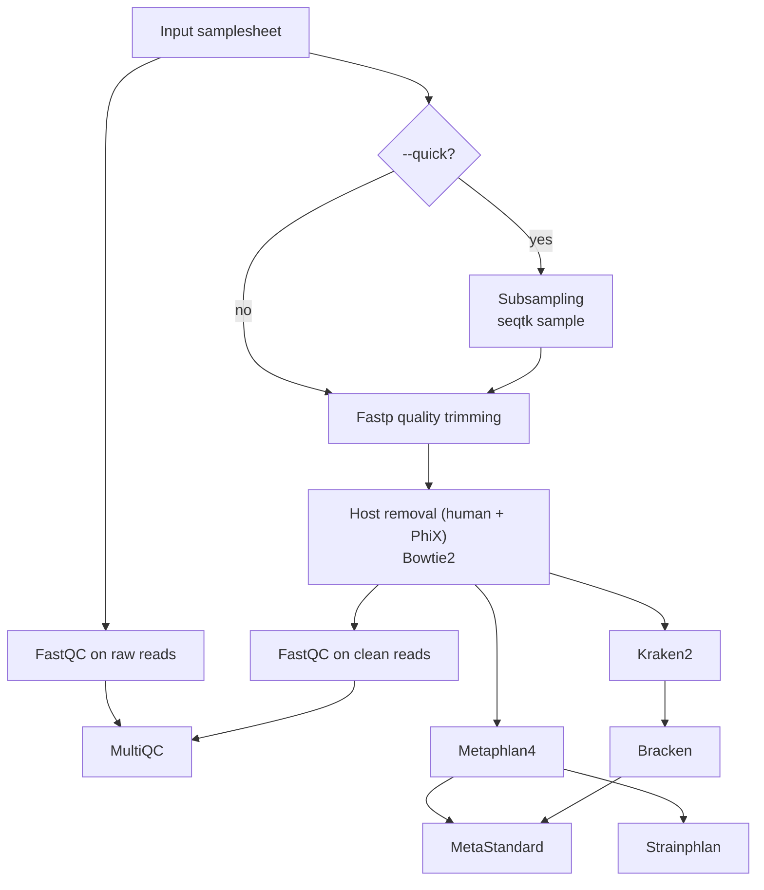

# 🧬 Metagenomic Profiling Pipeline

A Nextflow pipeline for taxonomic profiling of shotgun metagenomic data. It performs quality control, optional host decontamination, and parallel taxonomic classification using MetaPhlAn 4 and/or Kraken2+Bracken, followed by unified abundance table generation and visualisation.

**This repository includes a custom bioinformatic workflow for our lab (LPM IKEM, Prague, Czechia), all parameters are set to work properly on specific data from our lab. Before any usage, please check if it fits your data as well**

## Table of Contents
- 🧬 [Overview](#overview)
- 🚀 [Quick Usage](#quick-usage)
- 📦 [Requirements](#requirements)
- 🛠️ [Installation](#installation)
- 🔬 [Pipeline Description](#pipeline-description)
- 📥 [Inputs](#inputs)
- 📤 [Outputs](#outputs)
- 📚 [References](#references)

---

## Overview

The pipeline takes paired-end FASTQ files and a samplesheet as input and produces:

- Quality-controlled and trimmed reads
- Taxonomic abundance profiles (MetaPhlAn 4 and/or Kraken2+Bracken)
- Standardised, merged abundance tables (MetaStandard format)
- Stacked bar charts of community composition
- Optional strain-level phylogenetic analysis (StrainPhlAn)
- Optional mock community quality control with deviation metrics

---

## Quick Usage

```bash
nextflow run main.nf \
  --input samplesheet.csv \
  --outdir results/ 
```

For a fast test run using subsampled reads:

```bash
nextflow run main.nf \
  --input test/test_samplesheet.csv \
  --outdir results/ \
```

With host decontamination and Kraken2+Bracken enabled:

```bash
nextflow run main.nf \
  --input samplesheet.csv \
  --outdir results/ \
  --host_genome_index /path/to/human_index \
  --bowtie_phix_index /path/to/phix_index \
  --kraken_profiling \
  --database_cache_dir /path/to/db
```

---

## Requirements

User needs conda environment with Nextflow & Singularity installed. Everything else needed for the pipeline execution can be prepared with the ```setup_pipeline.sh``` script.

### Software

| Tool | Version | Purpose |
|------|---------|---------|
| [Nextflow](https://www.nextflow.io/) | ≥ 23.04 | Workflow manager |
| [FastQC](https://www.bioinformatics.babraham.ac.uk/projects/fastqc/) | any | Read quality assessment |
| [fastp](https://github.com/OpenGene/fastp) | any | Read trimming and filtering |
| [seqtk](https://github.com/lh3/seqtk) | any | Read subsampling (`--quick` mode) |
| [Bowtie2](https://bowtie-bio.sourceforge.net/bowtie2/) | any | Host and PhiX decontamination |
| [MetaPhlAn 4](https://github.com/biobakery/MetaPhlAn) | 4.x | Species-level profiling |
| [Kraken2](https://github.com/DerrickWood/kraken2) | any | k-mer based classification (optional) |
| [Bracken](https://github.com/jenniferlu717/Bracken) | any | Abundance re-estimation (optional) |
| [MultiQC](https://multiqc.info/) | any | QC report aggregation |
| Python | ≥ 3.8 | MetaStandard and plotting scripts |

### Reference databases

| Database | Used by 
|----------|---------|
| MetaPhlAn 4 DB (`mpa_vJan25_CHOCOPhlAnSGB_202503`) | MetaPhlAn 4, StrainPhlAn |
| Human reference index | Bowtie2 host removal | 
| PhiX index | Bowtie2 PhiX removal |
| Kraken2 database | Kraken2 + Bracken | 

---

## Installation

**1. Clone the repository**

```bash
git clone https://github.com/xpolak37/Metagenomics_workflow.git
cd Metagenomics_workflow
```

**2. Install Nextflow & Singularity**

```bash
conda install -c bioconda nextflow
conda install conda-forge::singularity
```

**3. Install pipeline dependencies**

Via ```setup_pipeline.sh``` script:

```bash
bash setup_pipeline.sh

```


## Pipeline Description



### Steps in detail

**Quality control (FastQC + fastp)**
Raw reads are assessed with FastQC before and after trimming. fastp handles adapter removal, quality-based filtering, polyG/X trimming, deduplication, and low-complexity filtering. Parameters are fully configurable (see [Inputs](#inputs)).

**Subsampling (seqtk) — optional**
When `--quick` is set, reads are subsampled to `--quick_depth` reads per sample before trimming. Useful for rapid testing.

**Host decontamination**
Reads mapping to the human reference genome (T2T-HLA + ARGOS + mycobacterial sequences) are removed with Bowtie2, followed by a second pass to remove PhiX174 spike-in reads. Reads are then re-paired and synchronised with fastp.

**MetaPhlAn 4 profiling**
Clean reads are profiled with MetaPhlAn 4 against the CHOCOPhlAn SGB database. Eukaryotes, bacteria, or archaea can be selectively excluded. If `--metaphlan_db` is not supplied, the database is automatically downloaded and cached.

**Strain-level profiling (StrainPhlAn) — optional**
When `--metaphlan_strain` is set and a target SGB clade is specified via `--strainphlan_sgb`, StrainPhlAn reconstructs strain-level phylogenies for that clade across all samples.

**Kraken2 + Bracken profiling — optional**
When `--kraken_profiling` is set, reads are classified with Kraken2 and abundance estimates are refined at species level with Bracken.

**MetaStandard — profile unification**
Per-sample MetaPhlAn 4 (and optionally Bracken) profiles are merged into a single wide-format TSV table (taxa × samples) with normalised relative abundances. Sample names are derived from the filename prefix. Unclassified reads are aggregated into a standardised `k__Unclassified` entry.

**Visualisation**
For each MetaStandard TSV, the pipeline generates a stacked bar chart (top N taxa by mean abundance, remainder collapsed to "Other") and a clustered heatmap.

**MultiQC**
QC metrics from FastQC (raw and clean) and fastp are aggregated into a single MultiQC HTML report.

---

## Inputs

### Samplesheet

A CSV file with three columns — no spaces, no extra headers:

```csv
sample,read1,read2
ERR001,/data/ERR001_R1.fastq.gz,/data/ERR001_R2.fastq.gz
ERR002,/data/ERR002_R1.fastq.gz,/data/ERR002_R2.fastq.gz
Mock1,/data/Mock1_R1.fastq.gz,/data/Mock1_R2.fastq.gz
```

| Column | Description |
|--------|-------------|
| `sample` | Unique sample identifier |
| `read1` | Absolute path to forward reads (gzipped FASTQ) |
| `read2` | Absolute path to reverse reads (gzipped FASTQ) |

### Pipeline parameters

| Parameter | Default | Description |
|-----------|---------|-------------|
| `--input` | required | Path to samplesheet CSV |
| `--outdir` | required | Output directory |
| `--run_id` | `run01` | Label appended to output filenames |
| `--tax_level` | `species` | Taxonomic level for MetaStandard output |
| `--quick` | `false` | Enable subsampling before trimming |
| `--quick_depth` | — | Number of reads to subsample per sample |
| `--host_decontamination` | `false` | Enable host + PhiX removal |
| `--host_genome_index` | — | Path to Bowtie2 human genome index directory |
| `--bowtie_phix_index` | — | Path to Bowtie2 PhiX index directory |
| `--kraken_profiling` | `false` | Enable Kraken2 + Bracken profiling |
| `--database_cache_dir` | — | Directory for cached databases (Kraken2, MetaPhlAn 4) |
| `--metaphlan_db` | `null` | Path to existing MetaPhlAn 4 database (auto-downloaded if unset) |
| `--metaphlan_strain` | `false` | Enable StrainPhlAn strain-level analysis |
| `--strainphlan_sgb` | — | Target SGB clade for StrainPhlAn (e.g. `SGB1877`) |
| `--metastandard_top_n` | `10` | Top N taxa shown in bar chart |

**fastp parameters** (key options — see `modules/fastp.nf` for the full list):

| Parameter | Default | Description |
|-----------|---------|-------------|
| `--fastp_qualified_quality_phred` | — | Minimum base quality score |
| `--fastp_unqualified_percent_limit` | — | Max % of bases below quality threshold |
| `--fastp_length_required` | — | Minimum read length to keep |
| `--fastp_length_limit` | — | Maximum read length |
| `--fastp_detect_adapter_for_pe` | `false` | Auto-detect adapters for paired-end data |
| `--fastp_dedup` | `false` | Remove duplicate reads |
| `--fastp_low_complexity_filter` | `false` | Filter low-complexity reads |
| `--fastp_correction` | `false` | Enable overlap-based base correction |
| `--fastp_trim_poly_g` | `false` | Trim polyG tails (NextSeq/NovaSeq) |
| `--fastp_extra_args` | `""` | Any additional fastp arguments |

---

## Outputs

```
results/
├── fastqc_raw/             # FastQC reports on raw reads
├── fastp/                  # Trimmed reads + fastp JSON/HTML reports
├── fastqc_clean/           # FastQC reports on trimmed reads
├── hostile/                # Decontaminated reads (if --host_decontamination)
├── metaphlan4/          # Per-sample MetaPhlAn 4 profiles (.txt)
├── strainphlan/         # StrainPhlAn output (if --metaphlan_strain)
├── kraken2/             # Kraken2 classification files (if --kraken_profiling)
├── bracken/             # Bracken abundance files (if --kraken_profiling)
├── metastandard/        # Merged abundance tables (TSV)
├── metastandard_plots/     # Bar charts and heatmaps (PNG)
└── multiqc/                # Aggregated MultiQC report
```

### Key output files

| File | Description |
|------|-------------|
| `metastandard/metaphlan4_<run_id>_species.tsv` | Merged MetaPhlAn 4 relative abundance table (taxa × samples) |
| `metastandard/bracken_<run_id>_species.tsv` | Merged Bracken relative abundance table (if enabled) |
| `metastandard_plots/*_barplot.png` | Stacked bar chart — top N taxa per sample |
| `multiqc/multiqc_report.html` | Aggregated QC report |


## References

- **fastp**: Chen S et al. (2018). fastp: an ultra-fast all-in-one FASTQ preprocessor. *Bioinformatics*, 34(17):i884–i890. https://doi.org/10.1093/bioinformatics/bty560
- **FastQC**: Andrews S. (2010). FastQC: A Quality Control tool for High Throughput Sequence Data. https://www.bioinformatics.babraham.ac.uk/projects/fastqc/
- **MultiQC**: Ewels P et al. (2016). MultiQC: summarize analysis results for multiple tools and samples in a single report. *Bioinformatics*, 32(19):3047–3048. https://doi.org/10.1093/bioinformatics/btw354
- **MetaPhlAn 4**: Blanco-Míguez A et al. (2023). Extending and improving metagenomic taxonomic profiling with uncharacterized species using MetaPhlAn 4. *Nature Biotechnology*, 41:1633–1644. https://doi.org/10.1038/s41587-023-01688-w
- **StrainPhlAn**: Beghini F et al. (2021). Integrating taxonomic, functional, and strain-level profiling of diverse microbial communities with bioBakery 3. *eLife*, 10:e65088. https://doi.org/10.7554/eLife.65088
- **Kraken2**: Wood DE, Lu J, Langmead B. (2019). Improved metagenomic analysis with Kraken 2. *Genome Biology*, 20:257. https://doi.org/10.1186/s13059-019-1891-0
- **Bracken**: Lu J et al. (2017). Bracken: estimating species abundance in metagenomics data. *PeerJ Computer Science*, 3:e104. https://doi.org/10.7717/peerj-cs.104
- **Bowtie2**: Langmead B, Salzberg SL. (2012). Fast gapped-read alignment with Bowtie 2. *Nature Methods*, 9:357–359. https://doi.org/10.1038/nmeth.1923
- **seqtk**: Li H. (2013). seqtk: a fast and lightweight tool for processing FASTA or FASTQ sequences. https://github.com/lh3/seqtk
- **Nextflow**: Di Tommaso P et al. (2017). Nextflow enables reproducible computational workflows. *Nature Biotechnology*, 35:316–319. https://doi.org/10.1038/nbt.3820
